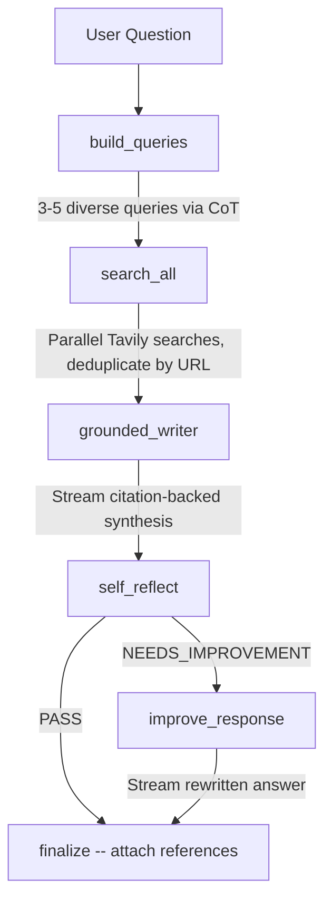

# Local Searcher

An AI-powered research assistant that searches the web and synthesizes citation-backed answers from multiple sources. Built with a LangGraph agent pipeline, dual LLM failover, token-by-token SSE streaming, and layered rate limiting.

**Live Demo**: [searcher.pgdev.com.br](https://searcher.pgdev.com.br)

---

## Architecture

The system is split into a Next.js frontend and a FastAPI backend. The frontend sends a user query via POST to the backend's SSE endpoint. The backend runs a LangGraph agent workflow that generates search queries, fetches web results via Tavily, synthesizes a grounded response with inline citations, self-reflects on quality, and optionally rewrites the answer. Tokens stream back to the frontend in real time. Two independent rate limiting layers (session-based and IP-based) gate every request before the agent executes.

---

## Search Algorithm



The LangGraph workflow consists of five nodes executed in sequence with one conditional branch:

1. **build_queries** -- The LLM applies chain-of-thought reasoning to decompose the user question into 3-5 diverse, searchable queries. Output is enforced via Pydantic structured output. If the primary LLM fails, the call automatically falls back to the secondary provider.

2. **search_all** -- Each generated query is sent to the Tavily API in parallel, retrieving up to 5 results per query. Results are deduplicated by URL. Tavily snippets are used directly as source content with no additional LLM summarization.

3. **grounded_writer** -- The LLM synthesizes a comprehensive response strictly grounded in the retrieved sources. Inline citations (`[1]`, `[2]`) are placed immediately after each claim. Conflicting information across sources is flagged. Tokens stream to the frontend via SSE as they are generated.

4. **self_reflect** -- The LLM evaluates its own response for completeness, accuracy, citation placement, clarity, and coverage. The output is a structured `ReflectionResult` with a verdict of either `PASS` or `NEEDS_IMPROVEMENT`.

5. **improve_response** (conditional) -- If the verdict is `NEEDS_IMPROVEMENT`, the response is rewritten once. The frontend receives a `replace` flag to clear the current output, then the improved version streams token-by-token. If the verdict is `PASS`, this node is skipped and the response is finalized as-is.

Each search triggers 3-5 LLM calls total: query generation, synthesis, reflection, and optionally improvement.

### SSE Event Flow

```
Backend                          Frontend
  |                                |
  |-- data: {event: "status"}  -->|  "Generating queries..."
  |-- data: {event: "queries"} -->|  Show query chips
  |-- data: {event: "source"}  -->|  Add source card
  |-- data: {event: "content",    |
  |    data: {token: "The"}}   -->|  Append "The"
  |-- data: {event: "content",    |
  |    data: {token: " latest"}}->|  Append " latest"
  |   ...                         |
  |-- data: {event: "done"}    -->|  Mark complete
```

---

## Tech Stack

| Component | Technology | Role |
|-----------|------------|------|
| Frontend | Next.js 16, React 19, TypeScript, Tailwind CSS v4, shadcn/ui | UI with real-time SSE streaming |
| XSS Protection | DOMPurify | Sanitizes all AI-generated HTML before rendering |
| Backend | FastAPI, Python 3.11+, Pydantic v2 | REST API with SSE streaming |
| Workflow Engine | LangGraph | Directed graph orchestration for the research pipeline |
| Primary LLM | Groq (llama-3.3-70b-versatile) | Ultra-fast inference on free tier |
| Fallback LLM | DeepSeek (deepseek-chat) | Automatic failover at $0.07/M input tokens |
| Web Search | Tavily API | Search and content extraction (free tier: 1000/month) |
| Session Management | In-memory with asyncio locks | Multi-user concurrency control |
| Reverse Proxy | Traefik v3 | Automatic HTTPS via Let's Encrypt |
| Containerization | Docker, Docker Compose | Production deployment |

### LLM Failover Strategy

The `LLMProvider` class implements automatic failover with periodic recovery:

1. All calls attempt the primary provider (Groq) first.
2. On failure, the system switches to the fallback (DeepSeek).
3. After 5 successful fallback calls, the primary is retried.
4. If the primary recovers, it becomes active again; otherwise the counter resets.

All call modes (invoke, structured output, streaming) share the same failover logic. Each call has a 30-second timeout.

---

## Getting Started

### Prerequisites

- Python 3.11+
- Node.js 20+
- API keys:
  - **Groq** (required, free tier): [console.groq.com](https://console.groq.com)
  - **Tavily** (required, free tier: 1000 searches/month): [tavily.com](https://tavily.com)
  - **DeepSeek** (optional fallback): [platform.deepseek.com](https://platform.deepseek.com)

### Environment Variables

#### Backend

| Variable | Default | Required | Description |
|----------|---------|----------|-------------|
| `ENV` | `development` | No | `development` or `production` |
| `GROQ_API_KEY` | -- | Yes | Groq API key |
| `GROQ_MODEL` | `llama-3.3-70b-versatile` | No | Groq model identifier |
| `DEEPSEEK_API_KEY` | -- | No | DeepSeek API key for fallback |
| `DEEPSEEK_MODEL` | `deepseek-chat` | No | DeepSeek model identifier |
| `TAVILY_API_KEY` | -- | Yes | Tavily API key |
| `TAVILY_MAX_RESULTS` | `5` | No | Results per search query |
| `MAX_CONCURRENT_SESSIONS` | `35` | No | Maximum simultaneous sessions |
| `MAX_SEARCHES_PER_SESSION` | `5` | No | Search quota per session |
| `MIN_SECONDS_BETWEEN_SEARCHES` | `10` | No | Session cooldown (seconds) |
| `IP_MAX_SEARCHES_PER_WINDOW` | `15` | No | Max searches per IP per window |
| `IP_WINDOW_SECONDS` | `3600` | No | IP rate limit window (seconds) |
| `IP_MIN_SECONDS_BETWEEN_SEARCHES` | `8` | No | IP cooldown (seconds) |
| `BACKEND_CORS_ORIGINS` | `["http://localhost:3000"]` | No | Allowed CORS origins (JSON array) |

#### Frontend

| Variable | Default | Description |
|----------|---------|-------------|
| `NEXT_PUBLIC_API_URL` | `http://localhost:8000/api/v1` | Backend API base URL |

### Local Development

**Backend:**

```bash
cd backend
python -m venv venv
source venv/bin/activate
pip install -r requirements.txt
cp .env.example .env
# Set GROQ_API_KEY and TAVILY_API_KEY in .env
uvicorn main:app --reload --port 8000
```

**Frontend:**

```bash
cd frontend
npm install
# Create .env.local with: NEXT_PUBLIC_API_URL=http://localhost:8000/api/v1
npm run dev
```

The frontend runs on `http://localhost:3000`, the backend on `http://localhost:8000`.

### Running with Docker

The included `docker-compose.yml` deploys both services behind Traefik with automatic HTTPS.

1. Create a DNS A record pointing your subdomain to the server IP.
2. Configure environment:
   ```bash
   cp .env.example .env
   # Set ENV=production
   # Set all API keys
   # Set BACKEND_CORS_ORIGINS=["https://your-domain.com"]
   ```
3. Deploy:
   ```bash
   docker compose up -d
   ```

The compose file runs two services:
- **searcher-backend** (port 8000): handles `/api/*` routes
- **searcher-frontend** (port 3000): handles all other routes

Both include health checks and Traefik security header middleware (HSTS, X-Frame-Options, X-Content-Type-Options, XSS filter, Referrer-Policy).

---

## API Reference

| Method | Endpoint | Description |
|--------|----------|-------------|
| `GET` | `/api/v1/health` | Health check with active session count |
| `GET` | `/api/v1/limits` | Rate limit configuration |
| `POST` | `/api/v1/search` | Synchronous search (full response) |
| `POST` | `/api/v1/search/stream` | Streaming search via SSE (recommended) |
| `GET` | `/api/v1/session/{id}` | Session info and remaining quota |
| `DELETE` | `/api/v1/session/{id}` | Delete a session |

### SSE Event Types

| Event | Data Fields | Description |
|-------|-------------|-------------|
| `session` | `session_id`, `remaining_searches` | Session initialization |
| `status` | `message`, `step`, `provider`, `current`, `total` | Pipeline progress |
| `queries` | `queries[]` | Generated search queries |
| `source` | `title`, `url`, `resume` | Individual source found |
| `content` | `token`, `replace`, `response` | Streaming response tokens |
| `done` | `provider` | Search complete |
| `error` | `message` | Error occurred |

---

## Rate Limits

Two independent layers protect against API cost abuse. Both must pass before a search executes.

| Layer | Scope | Limits | Bypassable |
|-------|-------|--------|------------|
| Session-based | Per browser session (localStorage) | 5 searches, 10s cooldown, 30min expiry | Yes (incognito, clear storage) |
| IP-based | Per client IP (X-Forwarded-For aware) | 15 searches/hour, 8s cooldown | No |

The IP-based layer prevents abuse via session rotation. Rate limit violations return HTTP 429 with the number of seconds to wait.
