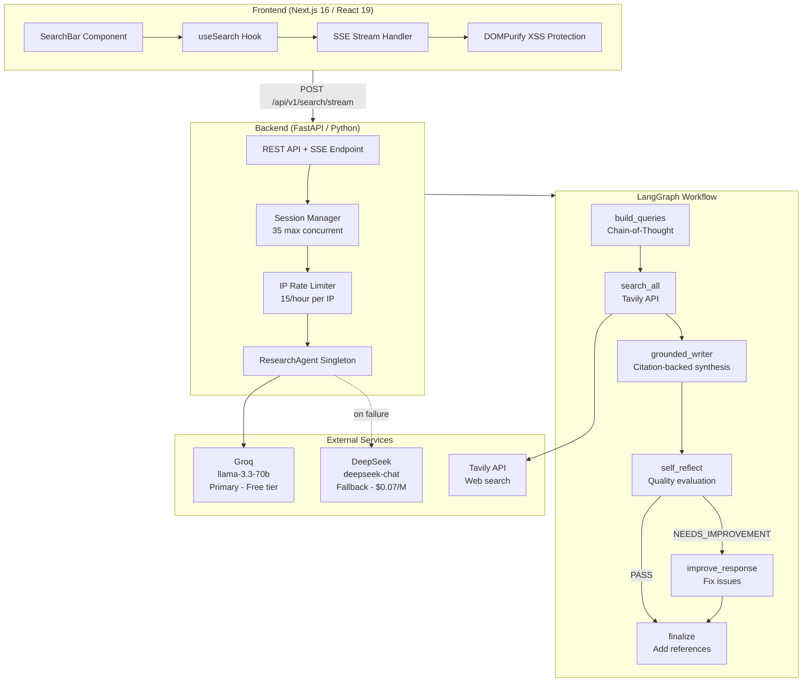

# Local Searcher

AI-powered research assistant that searches the web and synthesizes information from multiple sources into comprehensive, citation-backed responses. Built as a portfolio showcase project with cost control, abuse prevention, and production-grade streaming.


**Live Demo**: [searcher.pgdev.com.br](https://searcher.pgdev.com.br) | **Repository**: [GitHub](https://github.com/DevPedroGomes/local-searcher)

---

## Table of Contents

- [Architecture Overview](#architecture-overview)
- [How the AI Works](#how-the-ai-works)
- [Tech Stack](#tech-stack)
- [Security and Rate Limiting](#security-and-rate-limiting)
- [Project Structure](#project-structure)
- [API Reference](#api-reference)
- [Setup](#setup)
- [Deployment](#deployment)
- [Environment Variables](#environment-variables)
- [LLM Provider Strategy](#llm-provider-strategy)
- [Cost Estimation](#cost-estimation)

---

## Architecture Overview



---

## How the AI Works

The research pipeline is orchestrated by LangGraph as a directed graph with five nodes. Each search triggers 3-5 LLM calls total (down from ~28 in the initial implementation, after removing per-source summarization).

### 1. Chain-of-Thought Query Generation

The LLM receives the user question and follows a structured reasoning process to generate 3-5 diverse search queries:

1. **Understand** the core intent of the question
2. **Identify** key concepts and entities
3. **Consider** different angles (factual, opinion, recent developments)
4. **Diversify** query types for broader coverage
5. **Formulate** specific, searchable queries

Output is enforced via structured output (Pydantic schema), with automatic fallback to the secondary LLM provider if the primary fails.

### 2. Parallel Web Search

Each generated query is sent to the Tavily API, retrieving up to 5 results per query. Results are deduplicated by URL. The Tavily snippet is used directly as source content -- no additional LLM summarization calls are made.

### 3. Grounded Generation

The synthesis prompt enforces strict grounding rules:

- Only include information directly supported by the retrieved sources
- Place inline citations immediately after each claim: `[1]`, `[2]`
- Flag conflicting information from different sources
- Never hallucinate or add unsupported claims

Response tokens stream to the frontend in real time via Server-Sent Events (SSE).

### 4. Self-Reflection

After generating the draft, the LLM evaluates its own response using structured output (`ReflectionResult` schema with `verdict` and `issues` fields):

- **Completeness**: Does it fully answer the question?
- **Accuracy**: Are all claims supported by sources?
- **Citations**: Are they properly placed after each claim?
- **Clarity**: Is the response well-structured and readable?
- **Gaps**: Is important information from the sources missing?

The verdict is either `PASS` or `NEEDS_IMPROVEMENT`.

### 5. Improvement (Conditional)

If the reflection verdict is `NEEDS_IMPROVEMENT`, the response is rewritten once (max 1 iteration to control latency and cost). The frontend receives a `replace` flag to clear the current response, then the improved version streams token-by-token. If the verdict is `PASS`, the response is finalized as-is.

### Token-by-Token Streaming

The entire synthesis and improvement phases stream tokens incrementally to the frontend. The `LLMProvider.stream()` method yields individual tokens with automatic provider fallback. The frontend appends each token as it arrives, providing a real-time typing effect.

```
Backend                          Frontend
  |                                |
  |-- data: {event: "status"}  -->|  "Generating queries..."
  |-- data: {event: "queries"} -->|  Show query chips
  |-- data: {event: "source"}  -->|  Add source card
  |-- data: {event: "content",    |
  |    data: {token: "The"}}   -->|  Append "The"
  |-- data: {event: "content",    |
  |    data: {token: " latest"}}->|  Append " latest"
  |   ...                         |
  |-- data: {event: "done"}    -->|  Mark complete
```

---

## Tech Stack

| Layer | Technology | Purpose |
|-------|------------|---------|
| Frontend | Next.js 16, React 19, TypeScript, Tailwind CSS v4, shadcn/ui | Modern UI with real-time streaming |
| XSS Protection | DOMPurify | Sanitizes all AI-generated HTML before rendering |
| Backend | FastAPI, Python 3.11+, Pydantic v2 | REST API with SSE streaming |
| Workflow | LangGraph | Directed graph orchestration for the research pipeline |
| LLM (Primary) | Groq (llama-3.3-70b-versatile) | Ultra-fast inference on free tier |
| LLM (Fallback) | DeepSeek (deepseek-chat) | Automatic failover at $0.07/M input tokens |
| Web Search | Tavily API | Search and content extraction (free tier: 1000/month) |
| Session Management | In-memory with asyncio locks | Multi-user concurrency control |
| Reverse Proxy | Traefik v3 | Automatic HTTPS via Let's Encrypt, security headers |
| Containerization | Docker, Docker Compose | Production deployment |

---

## Security and Rate Limiting

### Security Features

| Feature | Implementation | Description |
|---------|---------------|-------------|
| XSS Protection | DOMPurify | Sanitizes all AI-generated content before DOM insertion |
| URL Sanitization | DOMPurify | Only allows `http://` and `https://` URLs in rendered output |
| CORS | Environment-based | Unrestricted in development, domain-locked in production |
| Error Sanitization | Conditional by `ENV` | Full stack traces in development, generic messages in production |
| Input Validation | Pydantic v2 | Schema validation with length limits on all API inputs |
| Security Headers | Traefik middleware | HSTS, X-Frame-Options, X-Content-Type, XSS filter, Referrer-Policy |

### Dual Rate Limiting

Two independent rate limiting layers protect against API cost abuse:

| Layer | Scope | Limits | Bypassable |
|-------|-------|--------|------------|
| Session-based | Per browser session (localStorage) | 5 searches, 10s cooldown, 30min expiry | Yes (incognito, clear storage) |
| IP-based | Per client IP (X-Forwarded-For aware) | 15 searches/hour, 8s cooldown | No |

The IP-based layer was added specifically to prevent abuse via session rotation. Both layers must pass before a search is executed. Rate limit errors return HTTP 429 with the number of seconds to wait.

### Session Limits

| Parameter | Value |
|-----------|-------|
| Max concurrent sessions | 35 |
| Searches per session | 5 |
| Cooldown between searches | 10 seconds |
| Session inactivity timeout | 30 minutes |

---

## Project Structure

```
local-searcher/
├── backend/
│   ├── app/
│   │   ├── api/routes/
│   │   │   └── search.py              # REST + SSE endpoints, IP extraction, error sanitization
│   │   ├── core/
│   │   │   ├── config.py              # Environment settings (ENV, CORS, rate limits)
│   │   │   ├── prompts.py             # CoT, grounded generation, self-reflection prompts
│   │   │   └── schemas.py             # Pydantic models (SearchRequest, ReflectionResult, etc.)
│   │   └── services/
│   │       ├── research_agent.py      # LangGraph workflow, LLMProvider with fallback + streaming
│   │       ├── session_manager.py     # Session-based rate limiting and quota tracking
│   │       └── ip_rate_limiter.py     # IP-based rate limiting (non-bypassable)
│   ├── main.py                        # FastAPI app initialization, CORS, router mounting
│   ├── requirements.txt
│   ├── .env.example
│   └── Dockerfile
├── frontend/
│   ├── src/
│   │   ├── app/
│   │   │   └── page.tsx               # Main page with search UI, status indicators, error handling
│   │   ├── components/search/
│   │   │   ├── SearchBar.tsx           # Input with loading/disabled states
│   │   │   ├── SearchStatus.tsx        # Progress indicator for each pipeline stage
│   │   │   ├── QueriesList.tsx         # Generated query chips
│   │   │   ├── SourcesList.tsx         # Source cards with URLs
│   │   │   ├── SourceCard.tsx          # Individual source display
│   │   │   └── ResponseDisplay.tsx     # Markdown rendering with DOMPurify sanitization
│   │   ├── hooks/
│   │   │   └── useSearch.ts            # SSE stream consumption, state management, retry logic
│   │   ├── lib/
│   │   │   └── api.ts                  # API client with SSE parsing
│   │   └── types/
│   │       └── index.ts                # TypeScript type definitions
│   ├── Dockerfile
│   └── package.json
├── docker-compose.yml                  # Production deployment with Traefik integration
├── .env                                # Production environment variables
└── README.md
```

---

## API Reference

| Method | Endpoint | Description |
|--------|----------|-------------|
| `GET` | `/api/v1/health` | Health check with active session count |
| `GET` | `/api/v1/limits` | Rate limit configuration |
| `POST` | `/api/v1/search` | Synchronous search (returns full response) |
| `POST` | `/api/v1/search/stream` | Streaming search via SSE (recommended) |
| `GET` | `/api/v1/session/{id}` | Session info and remaining quota |
| `DELETE` | `/api/v1/session/{id}` | Delete a session |

### SSE Event Types

The `/search/stream` endpoint emits the following event types:

| Event | Data Fields | Description |
|-------|-------------|-------------|
| `session` | `session_id`, `remaining_searches` | Session initialization |
| `status` | `message`, `step`, `provider`, `current`, `total` | Pipeline progress updates |
| `queries` | `queries[]` | Generated search queries |
| `source` | `title`, `url`, `resume` | Individual source found |
| `content` | `token`, `replace`, `response` | Streaming response tokens |
| `done` | `provider` | Search complete |
| `error` | `message` | Error occurred |

---

## Setup

### Prerequisites

- Python 3.11+
- Node.js 20+
- API keys:
  - **Groq** (required, free tier): [console.groq.com](https://console.groq.com)
  - **Tavily** (required, free tier: 1000 searches/month): [tavily.com](https://tavily.com)
  - **DeepSeek** (optional fallback): [platform.deepseek.com](https://platform.deepseek.com)

### Local Development

**Backend:**

```bash
cd backend
python -m venv venv
source venv/bin/activate
pip install -r requirements.txt
cp .env.example .env
# Edit .env: set GROQ_API_KEY and TAVILY_API_KEY
uvicorn main:app --reload --port 8000
```

**Frontend:**

```bash
cd frontend
npm install
# Create .env.local with: NEXT_PUBLIC_API_URL=http://localhost:8000/api/v1
npm run dev
```

The frontend runs on `http://localhost:3000` and connects to the backend at `http://localhost:8000`.

---

## Deployment

### Docker Compose (with Traefik)

The included `docker-compose.yml` is configured for deployment behind Traefik v3 with automatic HTTPS:

1. Create a DNS A record pointing `searcher.yourdomain.com` to your server IP
2. Copy and configure the environment file:
   ```bash
   cp .env.example .env
   # Set ENV=production
   # Set all API keys
   # Set BACKEND_CORS_ORIGINS=["https://searcher.yourdomain.com"]
   ```
3. Deploy:
   ```bash
   docker compose up -d
   ```

The compose file defines two services:

- **searcher-backend** (port 8000): Handles `/api/*` routes at priority 10
- **searcher-frontend** (port 3000): Handles all other routes at priority 1

Both services include health checks and security header middleware (HSTS, X-Frame-Options, X-Content-Type-Options, XSS filter, Referrer-Policy).

### Production Checklist

- Set `ENV=production` in the backend environment
- Configure `BACKEND_CORS_ORIGINS` with your frontend domain
- Set all required API keys (Groq, Tavily; optionally DeepSeek)
- Verify rate limit parameters match your expected traffic
- Test with a few searches to confirm end-to-end functionality
- Verify HTTPS: `curl -sI https://searcher.yourdomain.com | grep strict`

---

## Environment Variables

### Backend

| Variable | Default | Required | Description |
|----------|---------|----------|-------------|
| `ENV` | `development` | No | `development` or `production` |
| `GROQ_API_KEY` | -- | Yes | Groq API key for primary LLM |
| `GROQ_MODEL` | `llama-3.3-70b-versatile` | No | Groq model identifier |
| `DEEPSEEK_API_KEY` | -- | No | DeepSeek API key for fallback LLM |
| `DEEPSEEK_MODEL` | `deepseek-chat` | No | DeepSeek model identifier |
| `TAVILY_API_KEY` | -- | Yes | Tavily API key for web search |
| `TAVILY_MAX_RESULTS` | `5` | No | Results per search query |
| `MAX_CONCURRENT_SESSIONS` | `35` | No | Maximum simultaneous user sessions |
| `MAX_SEARCHES_PER_SESSION` | `5` | No | Search quota per session |
| `MIN_SECONDS_BETWEEN_SEARCHES` | `10` | No | Session cooldown between searches |
| `IP_MAX_SEARCHES_PER_WINDOW` | `15` | No | Max searches per IP per time window |
| `IP_WINDOW_SECONDS` | `3600` | No | IP rate limit window duration (seconds) |
| `IP_MIN_SECONDS_BETWEEN_SEARCHES` | `8` | No | IP cooldown between searches |
| `BACKEND_CORS_ORIGINS` | `["http://localhost:3000"]` | No | Allowed CORS origins (JSON array) |

### Frontend

| Variable | Default | Description |
|----------|---------|-------------|
| `NEXT_PUBLIC_API_URL` | `http://localhost:8000/api/v1` | Backend API base URL |

---

## LLM Provider Strategy

The `LLMProvider` class implements automatic failover with periodic recovery:

```
1. Try PRIMARY (Groq - free tier, ultra-fast)
   |-- Success --> continue using Groq
   |-- Failure --> switch to FALLBACK (DeepSeek)

2. While using FALLBACK:
   |-- Count successful DeepSeek calls
   |-- After 5 successful calls --> attempt PRIMARY again
       |-- Success --> return to Groq
       |-- Failure --> continue with DeepSeek, reset counter
```

All LLM calls (invoke, structured output, streaming) share the same fallback logic. Each call has a 30-second timeout to prevent hanging requests.

The provider supports three call modes:
- **invoke**: Standard prompt-to-response with `SystemMessage` + `HumanMessage` formatting
- **invoke_structured**: Pydantic schema enforcement via `with_structured_output`, used for query generation and self-reflection
- **stream**: Token-by-token generator for real-time synthesis streaming

---

## Cost Estimation

| Component | Free Tier | Paid Rate |
|-----------|-----------|-----------|
| Groq (primary LLM) | Generous free tier with rate limits | Pay-as-you-go |
| DeepSeek (fallback LLM) | -- | $0.07/M input tokens, $0.28/M output tokens |
| Tavily (web search) | 1000 searches/month | $0.01/search |

Each user search triggers 3-5 LLM calls (query generation, synthesis, reflection, and optionally improvement). With the default rate limits (5 searches/session, 15/hour per IP), a portfolio demo receiving moderate traffic should operate well within free tier limits.

---

## Future Improvements

See [future-improvements.md](future-improvements.md) for planned enhancements including dark mode, search history persistence, export functionality, and related question suggestions.

---

Built with Next.js, FastAPI, LangGraph, Groq, DeepSeek, and Tavily.
